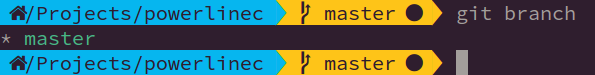

# powerlinec
A powerline-like prompt inspired by [bronze](https://github.com/reujab/bronze).



`powerlinec` is written as an exercise to create something similar to those fancy [powerline](https://github.com/powerline/powerline) shell prompts in one of my favorite languages: `C`. I wanted to figure out what features from other languages I would miss the most while writing it.

## Installation and configuration
Copy `powerlinec` to a directory in your _path_ and add these lines to your _.bashrc_ file:
```
function _update_ps1() {
	PS1="$(~/bin/powerlinec dir:blue:black git:green:black)"
}

PROMPT_COMMAND="_update_ps1;"
```
It uses the same command line arguments format than `bronze`, a powerline-like prompt written in `go`: segments are indicated as command line arguments following the format:
```
segment:background:foreground
```

### From source
The git segment makes use of the libgit2 library, `powerlinec` links the static version of libgit2 in an attempt to simplify the installation. As no Linux distribution includes a statically linked version of libgit2 (as far as I can tell), you'll need to compile it yourself or link to a dynamically compiled version.

After getting an adequate version of libgit2, just run `make` inside `powerlinec` folder to compile it.

Having to compile libgit2 when installing `bronze` (see [how to install bronze powerline like prompt on ubuntu](https://www.mexchip.com/en/2017/12/how-to-install-bronze-powerline-like-prompt-on-ubuntu/), was another motivation to create `powerlinec`, I wanted to check if linking to a static version of libgit2 could avoid the need for that.

## Segments
Three segments are implemented:
- dir, displays current working directory. Replaces $HOME with an icon.
- git, displays information from the current git repository: branch name, commits ahead/behind, if the branch has modifications and if a file has been staged.
- virtualenv: displays the content of the _$VIRTUAL_ENV_ environment variable, normally defined when running a _python virtual environment_.

## Icons
In order to correctly render the icons used by the dir and git segments, I recommend you to use a font from [Nerd Fonts](https://github.com/ryanoasis/nerd-fonts), otherwise, you'll need to patch your font.


## More segments/features
I have implemented the segments I used the most when I was using `bronze`, if you'd like more segments you can make a request, implement it yourself (pull requests are welcome) or you could try one of the following projects:
- [bronze](https://github.com/reujab/bronze), written in go, `powerlinec` is kind of an incomplete clone of this.
- [silver](https://github.com/reujab/silver), written in rust, a new version by the author of `bronze`.
- [powerline-go](https://github.com/justjanne/powerline-go), written in go.
- [powerline-shell](https://github.com/b-ryan/powerline-shell), written in python.
